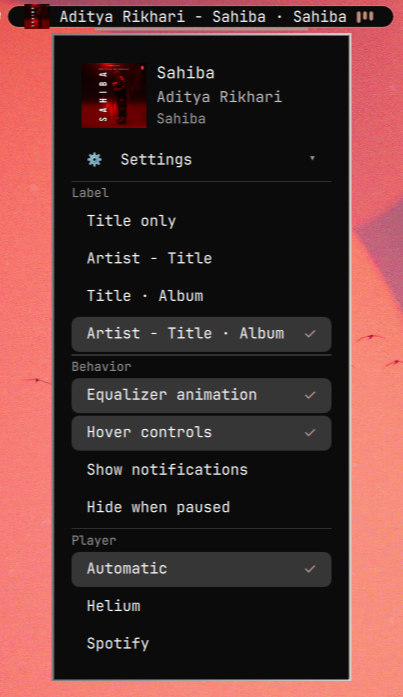

# Dynamic Island (`sharifmdathar.dynamic-island`)

A third-party Omarchy bar widget: a compact live pill for now-playing media
and notification previews. It collapses to zero width when idle, so it never
takes up bar space for nothing.

- `manifest.json` declares the plugin (`id: sharifmdathar.dynamic-island`,
  `kind: bar-widget`, default section `center`).
- `BarWidget.qml` is the whole widget: MPRIS media tracking, notification
  mirroring, the pill UI, and the right-click options menu.

Enable it with `omarchy plugin enable sharifmdathar.dynamic-island`; it lands in
the bar's center section next to the clock.

## Preview



## Installation

```sh
omarchy plugin add https://github.com/sharifmdathar/dynamic-island-omarchy.git --enable
```

This clones the repository as a shell plugin, validates its manifest, and
places the widget in the bar's center section. No other setup needed.

## Removal

```sh
omarchy plugin remove sharifmdathar.dynamic-island
```

Removal deletes the plugin directory. Your other bar layout entries are
untouched; the island's own layout entry (label mode, toggles, pinned
player) is dropped along with it.

## Gestures

- **Left click** the pill: play/pause toggle.
- **Middle click** the pill: raise the player window (ignored when the
  player can't raise).
- **Hover** the pill: swaps the label/EQ for prev / play-pause / next
  transport controls (disable via menu).
- **Scroll** on the pill: player volume ±5% per notch (ignored when the
  player reports no volume support).
- **Right click** the pill: opens the options menu. Clicking elsewhere
  dismisses it.

## Options menu

Right-click opens a now-playing header — large artwork, title, artist and
album on their own lines — with an elapsed / seek-bar / total row below
it when the player supports seeking (click or drag to seek), above a
**⚙ Settings** button. Click the
button (or the header) to expand the settings sections below. Everything
persists to the widget's `shell.json` layout entry via
`updateEntryInline`, so choices survive restarts and sync across monitors.

**Label** — what the pill shows for the current track:

| Mode | Renders as |
|---|---|
| Title only | `Title` |
| Artist - Title | `Artist - Title` |
| Title · Album | `Title · Album` |
| Artist - Title · Album | `Artist - Title · Album` |

Album modes fall back gracefully when the player reports no album.

**Behavior** — `Hide when paused` collapses the pill while paused
(resume playback, or `omarchy-shell island setOption hideWhenPaused false`,
to get the menu back), plus toggles for the equalizer animation, hover
transport controls, and notification previews.

**Player** — `Automatic` follows the most recently playing source; picking
a listed source pins the island to it until that source goes quiet.

Long row labels (e.g. the album variants at fixed menu width)
marquee-scroll on hover instead of clipping.

## Theming

All colors are theme-aware: pill and text follow `Color.bar`, selection
chrome follows the shared `Style` hover/selected fills with `Color.accent`.
No hardcoded colors — switching Omarchy themes (`omarchy theme set …`)
restyles the widget with the bar.

## Diagnostics

The widget exposes an `island` IPC target:

```sh
omarchy-shell island state                 # JSON: activity, media, position/length/canSeek, all options
omarchy-shell island ping                  # "ok"
omarchy-shell island controls true|false   # force hover controls (debug)
omarchy-shell island setOption <key> <true|false|value>
```

`setOption` writes through the same persisted-settings path as the menu.
